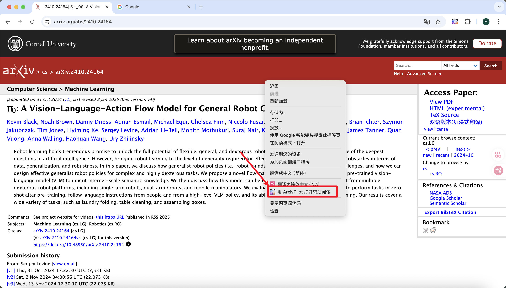
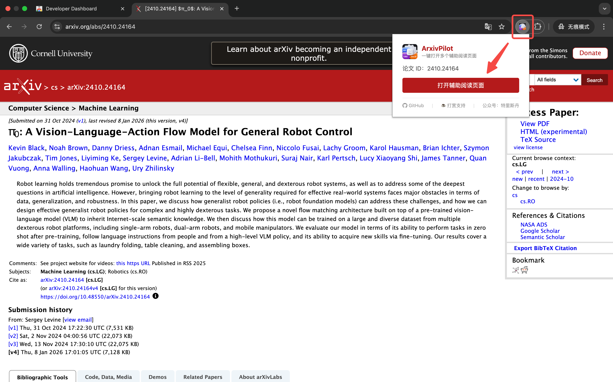
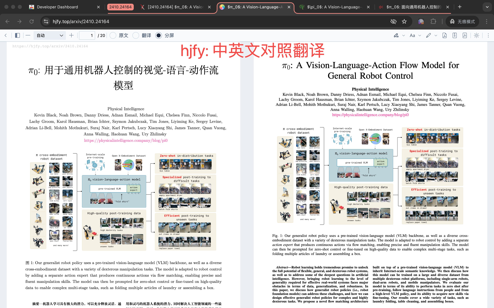
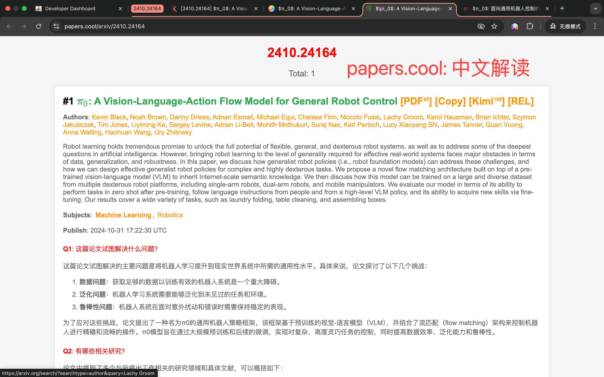
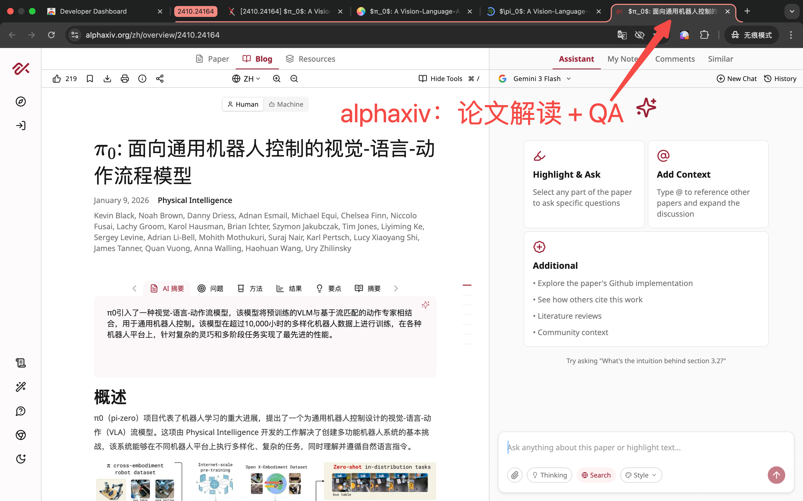

# ArxivPilot

[English](README.md) | [中文](README_CN.md)   

A Chrome extension that opens multiple reading-assistance tabs for any arXiv paper with a single click.


## Demo


| Right-click support | Manual input |
|---|---|
|  |  |

| 幻觉翻译 (HJFY) | KIMI 解读 | AlphaXiv |
|---|---|---|
|  |  |  |

## Features

- **One-click**: Automatically opens 3 auxiliary reading tools for the current arXiv paper
- **Tab grouping**: All tabs (arXiv + assistants) are grouped together automatically
- **Manual input**: Not on an arXiv page? Paste any arXiv URL or paper ID directly in the popup
- **Supports**: `arxiv.org/abs/`, `arxiv.org/pdf/`, `arxiv.org/html/` URL formats

## Bundled Sites

| Tool | URL Pattern |
|------|-------------|
| 幻觉翻译 (HJFY) | `hjfy.top/arxiv/{id}` |
| KIMI 解读 | `papers.cool/arxiv/{id}` |
| alphaxiv | `alphaxiv.org/overview/{id}` |

## Installation

### From Chrome Web Store

> Coming soon.

### Load Unpacked (Developer Mode)

1. Clone this repository:
   ```bash
   git clone https://github.com/weidafeng/ArxivPilot.git
   ```
2. Open Chrome and navigate to `chrome://extensions/`
3. Enable **Developer mode** (top-right toggle)
4. Click **Load unpacked** and select the cloned directory

## Usage

1. Open any arXiv paper page (e.g. `https://arxiv.org/abs/2603.16666`)
2. Click the **ArXiv Reader** icon in the toolbar
3. Click **打开辅助阅读页面** — all tabs open and are grouped automatically

If you are not on an arXiv page, paste a URL or paper ID into the input box and press **Enter** (or click the button).

## Project Structure

```
ArxivPilot/
├── manifest.json   # Chrome Extension Manifest V3
├── popup.html      # Popup UI
├── popup.js        # Core logic
└── icons/          # Extension icons (16, 48, 128px)
```

## Contributing

Pull requests are welcome. For major changes, please open an issue first.

## Support

If ArxivPilot saves you time, a coffee would mean a lot and help keep this project alive!


Scan with WeChat to support. If you find it useful, please also consider leaving a **5-star review** on the Chrome Web Store — it really helps others discover the extension.

Follow for more tools: **WeChat Official Account: 特里斯丹**

## License

[MIT](LICENSE)
